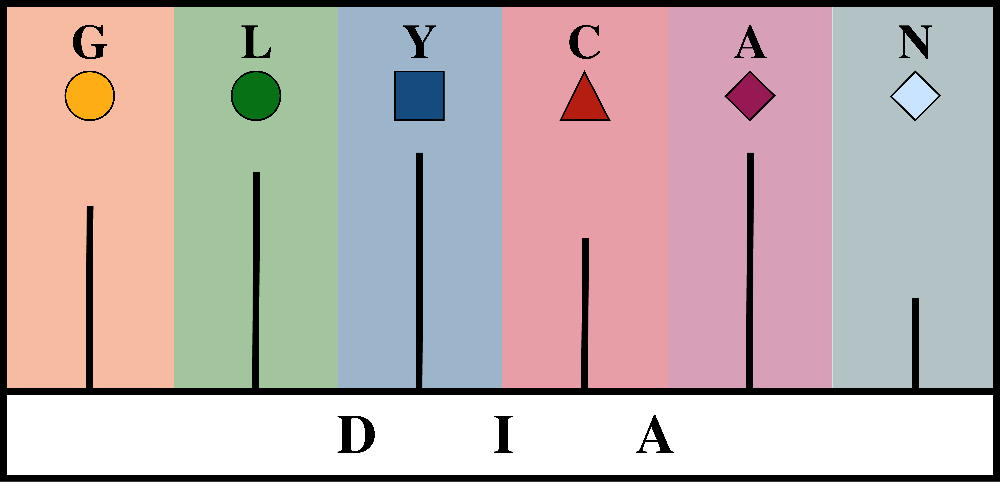

# GlycanDIA Finder

<p align="center">
    <br>
</p>

## Overview

Glycosylation is a prevalent feature of disease progression, reported in cases of cancer, diabetes, and Alzheimer's disease. The different glycan expressions significantly influence the biological activity of proteins via alternating glycoprotein structure and potentiating the binding of receptors. GlycanDIA Finder is an open-source software tool built upon Python for MS data. Its aim is to automatically analyze glycosylation with the sensitive data-independent acquisition (DIA) strategy. This tool can be installed on all kinds of platforms (e.g., Linux, macOS, Windows, etc).

## Requirements

- Recommended OS: macOS (>= 10.13), Linux (e.g. Ubuntu >= 18.04), or Windows (>= 10)
- Python3 (3.7 or higher is supported)
- Pip3
- Python dependencies: numpy, scipy, matchms
- Conda (optional): Miniconda or Anaconda

## Installation Guide

In order to use GlycanDIA Finder, you can install the dependent libraries either via package manager (Pip3) or by creating a new virtual environment with Conda

### Install via package

```
pip3 install scipy numpy matchms[chemistry]
```

### Install via Conda

```
conda create --name matchms python=3.8
conda activate matchms
conda install --channel bioconda --channel conda-forge matchms
```

## Usage Example
1. Download the source code of GlycanDIA Finder. You can manully download the zip file and unzip it, or you can use the following code to directly download it.
```
git clone https://github.com/ChenfengZhao/GlycanDIAFinder.git
```
The github repository is composed of the following parts:
- **GlycanDIAFinder.py** contains all the python code of GlycanDIA Finder.
- **config.ini** is to configure the internal parameters of the tool.
- **stagger_Nglycan_ExampleData.mzXML** is an example MS data file.
- **GlycanLibrary_list.csv** contains the supplementary information of data, such as the compounds and their notes, add-on masses, and MS2 masses (i.e. fragments) for each compound.

Here are the explaination on the parameters in config.ini:
- **decoy_mode**: iterative decoy searching to assess the false discovery rate (FDR)
- **input_path**: folder contains MS data files (.mzXML)
- **output_path**: folder to save the GlycanDIA search results (.mzXML)
- **ms_list_name**: glycan library that used for searching
- **polarity**: instrument polarity in MS analysis
- **max_charge**: maximum glycan charge that is calculated for searching
- **charge_range**: (alternatively to max_charge) a range of glycan charges that can be calculated
- **adduct**: adduct in MS analysis
- **ms1_mass_error_ppm**: mass tolerance for MS1 searching
- **ms2_mass_error_ppm**: mass tolerance for MS2 searching 
- **min_rel_height**: (optional) relative intensity threshold for glycan searching 
- **min_height**: (optional) absolute intensity threshold for glycan searching 
- **min_mass**: (optional) minimum m/z that is considered for glycan searching 
- **max_mass**: (optional) maximum m/z that is considered for glycan searching
- **min_time_min**: (optional) minimum retention time that is considered for glycan searching
- **max_time_min**: (optional) maximum retention time that is considered for glycan searching
- **min_matched_counts**: minimum MS2 ions that are required for glycan identification 
- **max_aligned_record_ms2**: the number of MS2 ions that are used for quantification
- **flex_mode**: (optional) disable of glycan monoisotopic distribution reqiuremnts 
  
1. Prepare your MS files and the GlycanLibrary_list.csv following the format of the example. Put these files under the path defined in the **input_path** of config.ini. GlycanDIA Finder automatically search and process all the MS files in right format in batches. Feel free to skip this step if you are just intented to process the example data.

3. Execute GlycanDIA Finder using the following code:

If the dependencies are installed via package manager
```
cd <the path of GlycanDIAFinder.py>
python3 GlycanDIAFinder.py
```

If the dependencies are installed by Conda
```
conda activate matchms
cd <the path of GlycanDIAFinder.py>
python3 GlycanDIAFinder.py
```

4. The results will be generated under the path defined in the **output_path** of config.ini (e.g., ExampleDataset/Results/ in this example). It contains the individual results of each compound and MS data file, combined results of all the compounds and each MS data file, and combined results of all the compounds and MS data files.


## Additional functions
1. To generate the precursor m/z values within user-defined windows and the corresponding potential fragments for a target glycan, run the following command:
```
python3 generate_glycan_ions.py
```
Below is an explanation of the parameters in the glycan_ions_config.ini file:
- **input_path**: Path to the file containing the glycan structure (e.g., *.txt)
- **output_path**: file to save precursor and fragments information(*.txt)
- **count**: number of break for  given glycans
- **windows_start**:  Starting m/z value for the user-defined window
- **windows_end**:  Ending m/z value for the user-defined window
2. To validate the search results, theoretical m/z values and peak intensity distributions are calculated. Additionally, similarity plots are generated and visualized based on the results from GlycanDIAFinder.
```
python3 isotopic_peak_distribution.py
```
Here are the explanation on the parameters in isotopic_peak_distribution_config.ini:
- **input_folder**: Folder containing the GlycanDIA search results (*.mzXML)
- **debug_file**: Path to the debug log file (e.g., *.txt)

> **Note**: Ensure that the required Python dependencies are installed before running the script, such as `pythoms`.

The results will be saved in the `distribution_plot` directory, which includes:
- **Cosine similarity plots** of the peak distributions
- **Detailed result file** with comprehensive information
## License
[Apache_2.0_license]: http://www.apache.org/licenses/LICENSE-2.0

The source code of this project is released under the [Apache 2.0 License][Apache_2.0_license].

## Citation
If you think GlycanDIA Finder is helpful for your research, please cite the following paper:

<!--[Removed to preserve anonymity]-->
```
@article{xie2024development,
  title={Development and application of GlycanDIA workflow for glycomic analysis},
  author={Xie, Yixuan and Liu, Xingyu and Zhao, Chenfeng and Chen, Siyu and Wang, Shunyang and Lin, Zongtao and Robison, Faith M and George, Benson M and Flynn, Ryan A and Lebrilla, Carlito B and others},
  journal={bioRxiv},
  year={2024},
  publisher={Cold Spring Harbor Laboratory}
}
```
